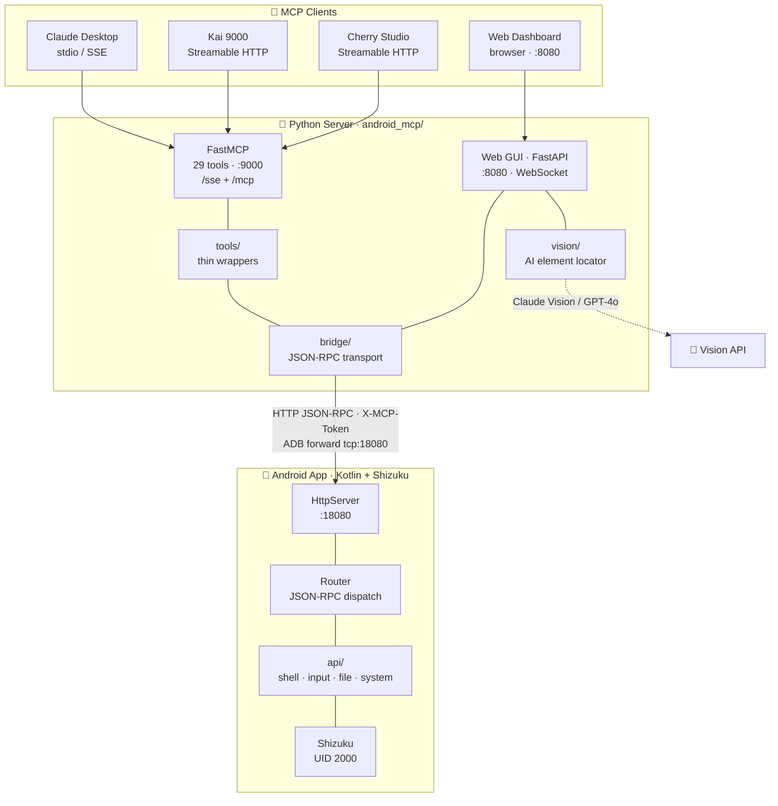

# Android MCP Server

**AI-powered Android device automation via MCP (Model Context Protocol).**

Control an Android phone with natural language — through Claude Desktop, Cherry Studio, Kai 9000, or the built-in Web GUI with AI chat.

<p align="center">
  <b>🇺🇸 English</b> &nbsp;|&nbsp; <a href="./README_zh.md">🇨🇳 中文</a>
</p>

<p align="center">
  <a href="https://github.com/shuao-pro/android-mcp"></a>
  <a href="https://github.com/shuao-pro/android-mcp"></a>
  
  
  
  
</p>

---

## 🏗️ Architecture

Three layers cooperate to turn a natural-language request into system-level actions on the device:



### Component breakdown

| Layer | Component | Responsibility | Key tech |
|-------|-----------|----------------|----------|
| **Clients** | Claude Desktop / Kai 9000 / Cherry Studio | Send tool calls as MCP messages | stdio, SSE, Streamable HTTP |
| | Web Dashboard | Browser panel, live screen, AI chat | FastAPI + WebSocket |
| **Python server** | `server.py` (FastMCP) | Registers 29 tools, speaks MCP | FastMCP |
| | `bridge/` | JSON-RPC → device, auto ADB forward | httpx, JSON-RPC 2.0 |
| | `tools/` | Thin `@bridge_call` wrappers | decorators |
| | `web/` | Dashboard API, chat, scrcpy stream | FastAPI, uvicorn |
| | `vision/` | AI screen-element recognition | Claude Vision / GPT-4o |
| **Android app** | `HttpServer` | Embedded HTTP server :18080, token auth | Java `ServerSocket` |
| | `Router` | JSON-RPC method dispatch | JSON-RPC 2.0 |
| | `api/*` | Shell, input, package, file, system | Shizuku API |
| | `util/` | Shizuku binder wrapper + token store | `ShizukuHelper`, `TokenStore` |

### Request lifecycle

Every tool call follows one path — e.g. `click(x, y)`:

1. **Client** sends `click(x, y)` over MCP (`:9000`) or the Web Dashboard (`:8080`).
2. **FastMCP / FastAPI** routes it to the matching `tools/` wrapper.
3. **`bridge/_core.py`** serializes it as a JSON-RPC 2.0 request, attaches the `X-MCP-Token` header, and POSTs to `http://127.0.0.1:18080/mcp` (re-establishing the ADB forward if needed).
4. **`HttpServer`** authenticates the token, then hands the request to `Router`.
5. **`Router`** dispatches to the right `api/*` module (e.g. `InputApi.tap`), which runs it via **Shizuku** (UID 2000) — no root required.
6. The JSON-RPC result travels back up the same chain.

### Ports & transports

| Port | Service | Transport | Consumers |
|------|---------|-----------|-----------|
| `:9000/sse` | MCP (SSE) | HTTP SSE | Claude Desktop (remote), web frontends |
| `:9000/mcp` | MCP (Streamable HTTP) | HTTP POST/GET | Kai 9000, Cherry Studio |
| `:8080` | Web Dashboard | HTTP + WebSocket | Browser |
| `:18080` | Android bridge | HTTP JSON-RPC (ADB-forwarded) | Python `bridge/` |
| *(stdio)* | MCP (stdio) | local pipe | Claude Desktop (local) |

> 💡 The server can run on the phone itself (Termux / Kai 9000). Set `ANDROID_HOST=127.0.0.1` — no ADB needed.
## ✨ Features

### Device Control (29 MCP Tools)

| Category | Tools |
|----------|-------|
| **Device** | `health_check`, `get_device_info`, `get_battery_info` |
| **Shell** | `shell` — any ADB-level command |
| **Input** | `click`, `long_click`, `swipe`, `drag`, `type_text`, `press_key` |
| **Apps** | `open_app`, `close_app`, `clear_app_data`, `install_app`, `uninstall_app`, `get_current_app`, `list_installed_apps` |
| **Screen** | `take_screenshot`, `get_ui_hierarchy` |
| **Files** | `read_file`, `write_file` (including `/data/data`) |
| **System** | `get_system_setting`, `put_system_setting`, `set_clipboard`, `get_clipboard`, `get_notifications`, `start_activity` |
| **Vision** | `find_element` — AI locates UI elements, `click_element` — find + click in one step |

### AI Vision

- AI-powered screen element recognition via Claude Vision / GPT-4o / custom API
- Natural language → pixel coordinates → automated click
- Example: `find_element("the login button")` → `{center_x: 540, center_y: 960, confidence: 0.95}`

### Web Dashboard

- **AI Chat** — control the phone by typing "open settings" or "click the search icon"
- **Live Screen** — 10fps WebSocket stream with click-to-touch
- **scrcpy** — native low-latency mirroring (one-click launch)
- **Setup Wizard** — guided 5-step setup with auto-detection + MCP SSE endpoint display
- **Settings Panel** — configure API providers + ADB device manager with .env sync
- **中/English** — full i18n support
- **Shell Terminal** — live ADB shell in the browser

### MCP Clients

Connect any MCP-compatible client to the server:

| Client | Transport | Endpoint | Platform |
|--------|-----------|----------|----------|
| **Kai 9000** | Streamable HTTP | `:9000/mcp` | Android (F-Droid) |
| **Cherry Studio** | Streamable HTTP | `:9000/mcp` | Windows / macOS / Linux |
| **Claude Desktop** | SSE / stdio | `:9000/sse` or `stdio` | Windows / macOS / Linux |
| **Termux + curl** | SSE | `:9000/sse` | Android (Termux) |

> **Cherry Studio config:** Set MCP type to `streamableHttp`, URL `http://<lan_ip>:9000/mcp`.
> Or import `cherry-studio-mcp.json` from the project root.

### MCP Transport

| Mode | Endpoint | Use Case |
|------|----------|----------|
| `stdio` | (local pipe) | Claude Desktop local integration |
| SSE | `:9000/sse` | Claude Desktop remote, web frontends |
| Streamable HTTP | `:9000/mcp` | Kai 9000, modern MCP clients |
| **Combined** (default) | **both on `:9000`** | **SSE + Streamable HTTP simultaneously** |


## 🔗 Links

| Resource | URL |
|----------|-----|
| **GitHub** | [github.com/shuao-pro/android-mcp](https://github.com/shuao-pro/android-mcp) |
| **Issues** | [Report a bug / Request feature](https://github.com/shuao-pro/android-mcp/issues) |
| **README 中文** | [README_zh.md](./README_zh.md) |

## 🚀 Quick Start

### Prerequisites

- Python 3.10+
- Android device with **Shizuku** installed
- ADB (Android SDK Platform Tools)
- scrcpy (optional, for native mirroring)

### 1. Install

```bash
git clone https://github.com/shuao-pro/android-mcp.git
cd android-mcp
pip install -e .
```

### 2. Setup

```bash
# First-time setup (configures .env)
bash scripts/setup.sh
```

Or manually:
```bash
cp .env.example .env
```

Install the Android APK to your phone:
```bash
# Pre-built APK (recommended) 鈥?from the android/ project
adb install "android/app/build/outputs/apk/debug/app-debug.apk"

# Or build from source
cd android && .\gradlew assembleDebug
adb install app/build/outputs/apk/debug/app-debug.apk
```

### 3. On Your Phone

1. Start **Shizuku** (grant root or wireless debugging permission)
2. Open **Android MCP** app → grant Shizuku permission → tap **Start**
3. Notification shows "MCP service running" on port 18080
4. Copy the **auth token** shown in the app into `.env` → `ANDROID_TOKEN=`

### 4. Start Server

```bash
# One-click (SSE + Web GUI + ADB forward)
./start.sh

# Windows
start.bat
```

Opens browser at `http://127.0.0.1:8080`.

### 5. Connect MCP Client

In the Web GUI, open **Menu → Setup** to see your MCP addresses:

| Client | Endpoint |
|--------|----------|
| **Kai 9000** (phone) | `http://192.168.x.x:9000/mcp` |
| **Claude Desktop** (remote) | `http://192.168.x.x:9000/sse` |
| **Same device** (Termux) | `http://127.0.0.1:9000/sse` or `/mcp` |

Add the address in Kai 9000 (Settings → MCP Servers → Add) or Claude Desktop:

```json
{
  "mcpServers": {
    "android": {
      "command": "python",
      "args": ["-m", "android_mcp.main", "--mode", "mcp"]
    }
  }
}
```

Now chat with the AI to control your phone — "open settings", "take a screenshot", "click the search button".

---

## ⚙️ Configuration

Edit `.env`:

```env
# Device connection
ANDROID_HOST=127.0.0.1
ANDROID_PORT=18080

# Android bridge auth token (shown in the app UI — copy it here)
ANDROID_TOKEN=

# Web GUI
WEB_HOST=127.0.0.1
WEB_PORT=8080

# MCP Server (SSE + Streamable HTTP) — for Kai 9000 & other clients
# Defaults to 127.0.0.1 (local-only, secure); set 0.0.0.0 for WiFi/phone clients
MCP_HOST=127.0.0.1
MCP_PORT=9000

# AI Vision (optional — enables AI chat + element recognition)
VISION_PROVIDER=anthropic       # anthropic | openai | custom
VISION_API_KEY=sk-ant-api03-xxxxx
VISION_MODEL=                   # leave empty for default
VISION_API_BASE=                # only for custom provider
```

---

## 🖥️ CLI Commands

```bash
# Start modes
python -m android_mcp.main --mode all-sse   # SSE + Streamable HTTP + Web GUI (default)
python -m android_mcp.main --mode mcp       # stdio only (Claude Desktop)
python -m android_mcp.main --mode mcp-sse   # SSE + Streamable HTTP (headless)
python -m android_mcp.main --mode mcp-http  # Streamable HTTP only
python -m android_mcp.main --mode web       # Web GUI only

# Process management
python -m android_mcp.gateway start         # Start as daemon
python -m android_mcp.gateway status        # Check status
python -m android_mcp.gateway stop          # Stop daemon
python -m android_mcp.gateway forward       # Set up ADB port forward
```

## 📁 Project Structure

```
android-mcp/
├── android_mcp/
│   ├── server.py          # FastMCP server definition (tool registry)
│   ├── main.py            # Entry point (mode dispatch)
│   ├── config.py          # Environment config (.env loader)
│   ├── console.py         # Colored console output helpers
│   ├── utils.py           # LAN IP + version helpers
│   ├── gateway.py         # CLI process manager
│   ├── bridge/            # Low-level HTTP bridge to Android device
│   │   ├── __init__.py    # Re-exports all bridge functions
│   │   ├── _core.py       # JSON-RPC transport + ADB forward helpers
│   │   ├── device.py      # Health, info, screenshot, shell, reboot
│   │   ├── input.py       # Click, swipe, drag, keys, type_text
│   │   ├── apps.py        # Package management
│   │   ├── system.py      # Battery, clipboard, notifications, settings
│   │   └── files.py       # File read/write/list/delete
│   ├── tools/             # MCP tool layer (thin wrappers over bridge)
│   │   ├── decorators.py  # @bridge_call error-handling decorator
│   │   ├── device.py      # Health, info, battery, screenshot, UI hierarchy
│   │   ├── input.py       # Touch, swipe, keys
│   │   ├── apps.py        # Package management
│   │   ├── system.py      # Shell, settings, clipboard
│   │   ├── files.py       # File read/write
│   │   └── vision.py      # AI element recognition
│   ├── vision/            # Vision model clients
│   │   ├── models.py      # Data classes + Protocol
│   │   ├── clients.py     # Anthropic + OpenAI clients
│   │   └── prompts.py     # Prompt builder + parser
│   └── web/               # Web GUI
│       ├── server.py      # FastAPI + WebSocket
│       ├── chat_agent.py  # AI chat → tool execution
│       ├── scrcpy_bridge.py # scrcpy + frame streaming
│       └── static/        # HTML/CSS/JS frontend
├── android/               # Android APK project
│   ├── app/src/main/
│   │   ├── java/com/example/androidmcp/
│   │   │   ├── App.kt             # Application class
│   │   │   ├── MainActivity.kt    # Main UI + Shizuku auth
│   │   │   ├── McpService.kt      # Foreground service
│   │   │   ├── api/
│   │   │   │   ├── FileApi.kt     # File read/write/delete
│   │   │   │   ├── InputApi.kt    # Touch, swipe, key events
│   │   │   │   ├── PackageApi.kt  # App install/uninstall
│   │   │   │   ├── ShellApi.kt    # Shell command execution
│   │   │   │   └── SystemApi.kt   # Screenshot, clipboard, settings
│   │   │   ├── server/
│   │   │   │   ├── HttpServer.kt  # Embedded HTTP server (:18080)
│   │   │   │   └── Router.kt      # JSON-RPC method dispatch
│   │   │   └── util/
│   │   │       ├── ShizukuHelper.kt # Shizuku binder wrapper
│   │   │       └── TokenStore.kt    # Bridge auth token (generate + persist)
│   │   └── res/                   # Layout, drawable, strings
│   ├── gradle/                    # Gradle wrapper
│   ├── build.gradle.kts
│   └── settings.gradle.kts
├── scripts/setup.sh       # First-time setup
├── tests/                 # Test scripts
│   ├── test_adb.py        # ADB bridge tests
│   └── test_all.py        # End-to-end tests
├── start.sh               # One-click start
├── start.bat              # Windows launcher
├── pyproject.toml
└── .env.example
```

---

## 📋 Requirements

| Component | Requirement |
|-----------|-------------|
| Python | 3.10+ |
| Android | 11+ (API 30+) |
| Android App | Shizuku installed and running |
| ADB | Platform Tools (for port forward) |
| scrcpy | Optional (native mirroring) |
| AI Vision | Anthropic/OpenAI API key (optional) |
| MCP Client | Kai 9000 (F-Droid), Claude Desktop, or any SSE/stdio MCP client |

---

## 📄 License

MIT
