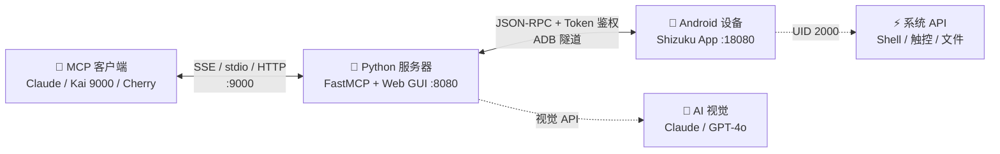

# Android MCP Server

**基于 MCP 协议的 AI 驱动 Android 设备自动化控制。**

通过 Claude Desktop、Cherry Studio、Kai 9000、或内置的 AI 对话 Web 界面，用自然语言操控你的 Android 手机。

<p align="center">
  <a href="./README.md">🇺🇸 English</a> &nbsp;|&nbsp; <b>🇨🇳 中文</b>
</p>

<p align="center">
  <a href="https://github.com/shuao-pro/android-mcp"></a>
  
  
  
  
</p>

---

## 🏗️ 架构



| 层级 | 角色 | 关键技术 |
|------|------|----------|
| 🤖 **MCP 客户端** | AI 助手通过 MCP 连接 | Claude Desktop、Kai 9000、Cherry Studio |
| 🐍 **Python 服务器** | 工具注册、Web GUI、AI 聊天代理 | FastMCP + FastAPI + WebSocket |
| 📱 **Android 应用** | 设备端系统级执行 | Shizuku (UID 2000)、HTTP JSON-RPC |

> 🔒 **通信鉴权**：Python 网关 ↔ Android 应用通过共享 `X-MCP-Token` 统一鉴权。App 随机生成 token 并显示在界面，复制到 `.env` 的 `ANDROID_TOKEN=` 即可。默认 `MCP_HOST=127.0.0.1`（仅本机访问）。

> 💡 服务器可直接在手机上运行（Termux / Kai 9000）。设置 `ANDROID_HOST=127.0.0.1` — 无需 ADB。
## 功能特性

### 设备控制（29 个 MCP 工具）

| 分类 | 工具 |
|------|------|
| **设备状态** | `health_check`、`get_device_info`、`get_battery_info` |
| **Shell** | `shell` — 执行任意 ADB 级命令 |
| **触控** | `click`、`long_click`、`swipe`、`drag`、`type_text`、`press_key` |
| **应用管理** | `open_app`、`close_app`、`clear_app_data`、`install_app`、`uninstall_app`、`get_current_app`、`list_installed_apps` |
| **屏幕** | `take_screenshot`、`get_ui_hierarchy` |
| **文件** | `read_file`、`write_file`（支持 `/data/data` 受限目录） |
| **系统** | `get_system_setting`、`put_system_setting`、`set_clipboard`、`get_clipboard`、`get_notifications`、`start_activity` |
| **AI 视觉** | `find_element` — AI 定位屏幕元素，`click_element` — 识别+点击一步完成 |

### AI 视觉

- 接入 Claude Vision / GPT-4o / 自定义 API 进行屏幕元素识别
- 自然语言描述 → 像素坐标 → 自动点击
- 示例：`find_element("登录按钮")` → `{center_x: 540, center_y: 960, confidence: 0.95}`

### Web 控制台

- **AI 对话** — 输入"打开设置"、"点击搜索图标"即可操控手机
- **实时画面** — 10fps WebSocket 推流，点击画面直接触控
- **scrcpy 投屏** — 一键启动原生低延迟投屏窗口
- **连接向导** — 5 步引导式配置，自动检测前置条件 + 显示 MCP SSE 地址
- **设置面板** — 可视化配置 API 供应商 + ADB 设备管理，自动同步 .env
- **中/English** — 完整国际化支持
- **Shell 终端** — 浏览器内实时 ADB Shell

### MCP 客户端

将任意 MCP 兼容客户端连接到服务器：

| 客户端 | 传输方式 | 端点 | 平台 |
|--------|----------|------|------|
| **Kai 9000** | Streamable HTTP | `:9000/mcp` | Android (F-Droid) |
| **Cherry Studio** | Streamable HTTP | `:9000/mcp` | Windows / macOS / Linux |
| **Claude Desktop** | SSE / stdio | `:9000/sse` 或 `stdio` | Windows / macOS / Linux |
| **Termux + curl** | SSE | `:9000/sse` | Android (Termux) |

> **Cherry Studio 配置:** MCP 类型选 `streamableHttp`，URL 填 `http://<局域网IP>:9000/mcp`。
> 或直接导入项目根目录的 `cherry-studio-mcp.json`。

### MCP 传输模式

| 模式 | 端点 | 适用场景 |
|------|------|----------|
| `stdio` | (本地管道) | Claude Desktop 本地集成 |
| SSE | `:9000/sse` | Claude Desktop 远程、Web 前端 |
| Streamable HTTP | `:9000/mcp` | Kai 9000、现代 MCP 客户端 |
| **Combined**（默认） | **两者同端口 `:9000`** | **SSE + Streamable HTTP 同时运行** |

---


---

## 🔗 链接

| 资源 | URL |
|------|-----|
| **GitHub** | [github.com/shuao-pro/android-mcp](https://github.com/shuao-pro/android-mcp) |
| **Issues** | [报告问题 / 请求功能](https://github.com/shuao-pro/android-mcp/issues) |
| **README English** | [README.md](./README.md) |

## 快速开始

### 前置条件

- Python 3.10+
- Android 设备已安装 **Shizuku**
- ADB（Android SDK Platform Tools）
- scrcpy（可选，用于原生投屏）

### 1. 安装

```bash
git clone https://github.com/shuao-pro/android-mcp.git
cd android-mcp
pip install -e .
```

### 2. 环境配置

```bash
# 首次配置（创建 .env）
bash scripts/setup.sh
```

或手动：
```bash
cp .env.example .env
```

安装 Android APK 到手机：
```bash
# 使用预编译 APK（推荐）
adb install android/app/build/outputs/apk/debug/app-debug.apk

# 或从源码编译
cd .. && cd "android-mcp apk" && .\gradlew assembleDebug
adb install app/build/outputs/apk/debug/app-debug.apk
```

### 3. 手机端操作

1. 启动 **Shizuku**（授予 root 或无线调试权限）
2. 打开 **Android MCP** 应用 → 授予 Shizuku 权限 → 点击 **启动**
3. 通知栏显示"MCP 服务运行中"（端口 18080）
4. 复制界面显示的 **鉴权 Token**，填入 `.env` 的 `ANDROID_TOKEN=`

### 4. 启动服务

```bash
# 一键启动（SSE + Web GUI + ADB 转发）
./start.sh

# Windows 系统
start.bat
```

浏览器自动打开 `http://127.0.0.1:8080`。

### 5. 连接 MCP 客户端

在 Web 控制台中打开 **菜单 → 配置向导** 查看 MCP 地址：

| 客户端 | 端点 |
|--------|------|
| **Kai 9000**（手机） | `http://192.168.x.x:9000/mcp` |
| **Claude Desktop**（远程） | `http://192.168.x.x:9000/sse` |
| **同设备**（Termux） | `http://127.0.0.1:9000/sse` 或 `/mcp` |

将地址添加到 Kai 9000（设置 → MCP 服务器 → 添加）或 Claude Desktop：

```json
{
  "mcpServers": {
    "android": {
      "command": "python",
      "args": ["-m", "android_mcp.main", "--mode", "mcp"]
    }
  }
}
```

现在即可通过对话操控手机 — "打开设置"、"截屏"、"点击搜索按钮"。

---

## 配置说明

编辑 `.env` 文件：

```env
# 设备连接
ANDROID_HOST=127.0.0.1
ANDROID_PORT=18080

# Android 桥接鉴权 Token（App 界面显示，复制到这里）
ANDROID_TOKEN=

# Web 控制台
WEB_HOST=127.0.0.1
WEB_PORT=8080

# MCP 服务（SSE + Streamable HTTP）— 供 Kai 9000 等客户端接入
# 默认 127.0.0.1（仅本机，安全）；如需手机/WiFi 客户端连接改为 0.0.0.0
MCP_HOST=127.0.0.1
MCP_PORT=9000

# AI 视觉（可选 — 启用 AI 对话和元素识别）
VISION_PROVIDER=anthropic       # anthropic | openai | custom
VISION_API_KEY=sk-ant-api03-xxxxx
VISION_MODEL=                   # 留空使用默认模型
VISION_API_BASE=                # 仅 custom 供应商需要
```

---

## CLI 命令

```bash
# 启动模式
python -m android_mcp.main --mode all-sse   # SSE + Streamable HTTP + Web GUI（默认）
python -m android_mcp.main --mode mcp       # stdio 模式（Claude Desktop）
python -m android_mcp.main --mode mcp-sse   # SSE + Streamable HTTP（无头）
python -m android_mcp.main --mode mcp-http  # Streamable HTTP 模式
python -m android_mcp.main --mode web       # 仅 Web GUI

# 进程管理
python -m android_mcp.gateway start         # 后台启动
python -m android_mcp.gateway status        # 查看状态
python -m android_mcp.gateway stop          # 停止服务
python -m android_mcp.gateway forward       # ADB 端口转发
```

## 项目结构

```
android-mcp/
├── android_mcp/
│   ├── server.py          # FastMCP 服务定义
│   ├── main.py            # 入口
│   ├── config.py          # 环境配置
│   ├── bridge.py          # Android HTTP 桥接
│   ├── gateway.py         # CLI 进程管理
│   ├── tools/             # MCP 工具实现（按领域拆分）
│   │   ├── device.py      # 健康检查、设备信息、截图
│   │   ├── input.py       # 触控、滑动、按键
│   │   ├── apps.py        # 应用管理
│   │   ├── system.py      # Shell、设置、剪贴板
│   │   ├── files.py       # 文件读写
│   │   └── vision.py      # AI 元素识别
│   ├── vision/            # 视觉模型客户端
│   │   ├── models.py      # 数据结构 + Protocol
│   │   ├── clients.py     # Anthropic + OpenAI 客户端
│   │   └── prompts.py     # 提示词 + 解析器
│   └── web/               # Web 控制台
│       ├── server.py      # FastAPI + WebSocket
│       ├── chat_agent.py  # AI 对话 → 工具执行
│       ├── scrcpy_bridge.py # scrcpy + 画面推流
│       └── static/        # HTML/CSS/JS 前端
├── android/               # Android APK 项目
│   ├── app/src/main/
│   │   ├── java/com/example/androidmcp/
│   │   │   ├── App.kt             # Application 入口
│   │   │   ├── MainActivity.kt    # 主界面 + Shizuku 授权
│   │   │   ├── McpService.kt      # 前台服务
│   │   │   ├── api/
│   │   │   │   ├── FileApi.kt     # 文件读写/删除
│   │   │   │   ├── InputApi.kt    # 触控、滑动、按键
│   │   │   │   ├── PackageApi.kt  # 应用安装/卸载
│   │   │   │   ├── ShellApi.kt    # Shell 命令执行
│   │   │   │   └── SystemApi.kt   # 截图、剪贴板、系统设置
│   │   │   ├── server/
│   │   │   │   ├── HttpServer.kt  # 内嵌 HTTP 服务器 (:18080)
│   │   │   │   └── Router.kt      # JSON-RPC 方法路由
│   │   │   └── util/
│   │   │       ├── ShizukuHelper.kt # Shizuku binder 封装
│   │   │       └── TokenStore.kt    # 桥接鉴权 Token（生成 + 持久化）
│   │   └── res/                   # 布局、图标、字符串资源
│   ├── gradle/                    # Gradle 构建系统
│   ├── build.gradle.kts
│   └── settings.gradle.kts
├── scripts/setup.sh       # 首次配置脚本
├── start.sh               # 一键启动脚本
├── start.bat              # Windows 启动脚本
├── pyproject.toml
└── .env.example
```

---

## 环境要求

| 组件 | 要求 |
|------|------|
| Python | 3.10+ |
| Android | 11+ (API 30+) |
| 手机端 | Shizuku 已安装并运行 |
| ADB | Platform Tools（用于端口转发） |
| scrcpy | 可选（原生投屏） |
| AI 视觉 | Anthropic/OpenAI API Key（可选） |
| MCP 客户端 | Kai 9000（F-Droid）、Claude Desktop、或任意 SSE/stdio MCP 客户端 |

---

## 许可证

MIT
